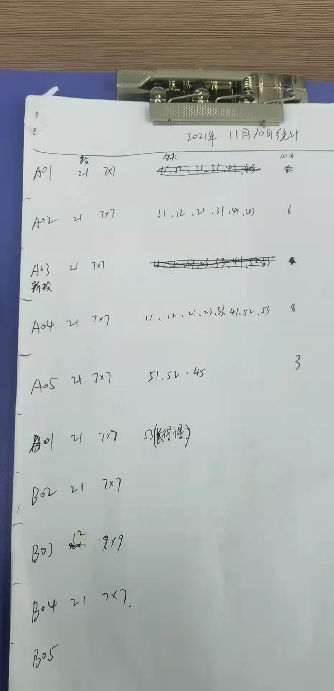

# 
小精灵缺陷标注及识别

## 一、缺陷标注
### 1.1 常规图片缺陷标注
缺陷标注分为3类：白色亮点、黑色暗斑、大面积的缺陷

图一：白色亮点和黑色暗斑标注

    

    

# Test

# Test

    

### 1.2 特殊图片缺陷标注（缺陷位置可能未最终核验，故标注原则以图片显示缺陷为准）
这里特殊图片是指1.实际给出的缺陷位置在图片上不明显2.实际未给出缺陷位置的地方有缺陷出现

图一：11月5日A02右缺陷25、35、44、45

